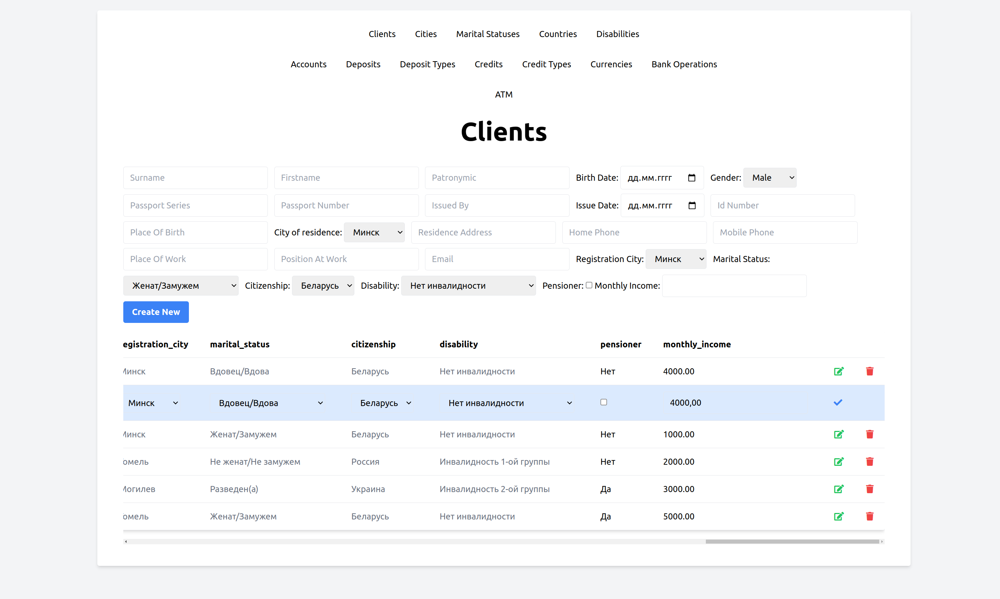
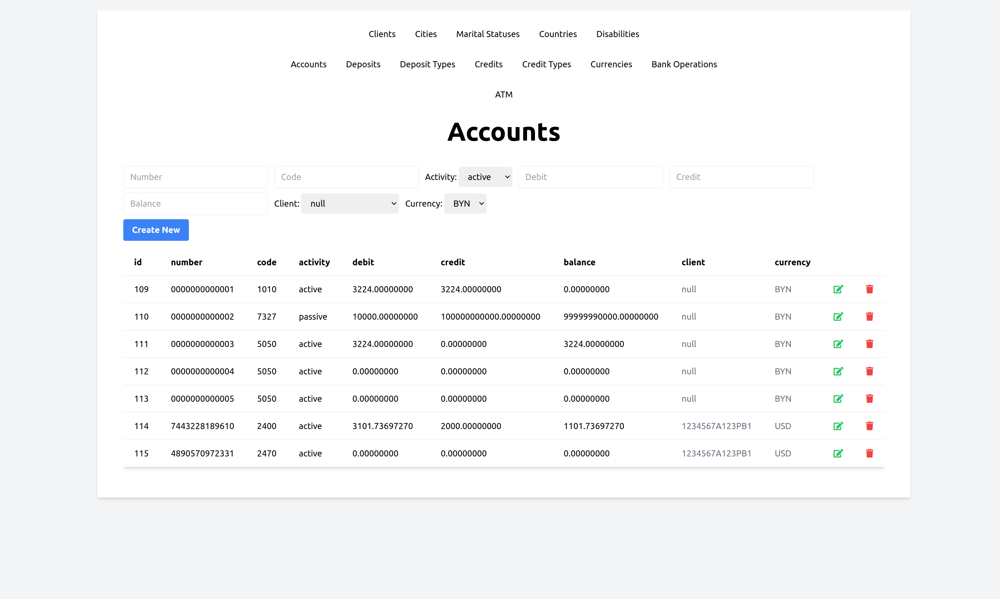
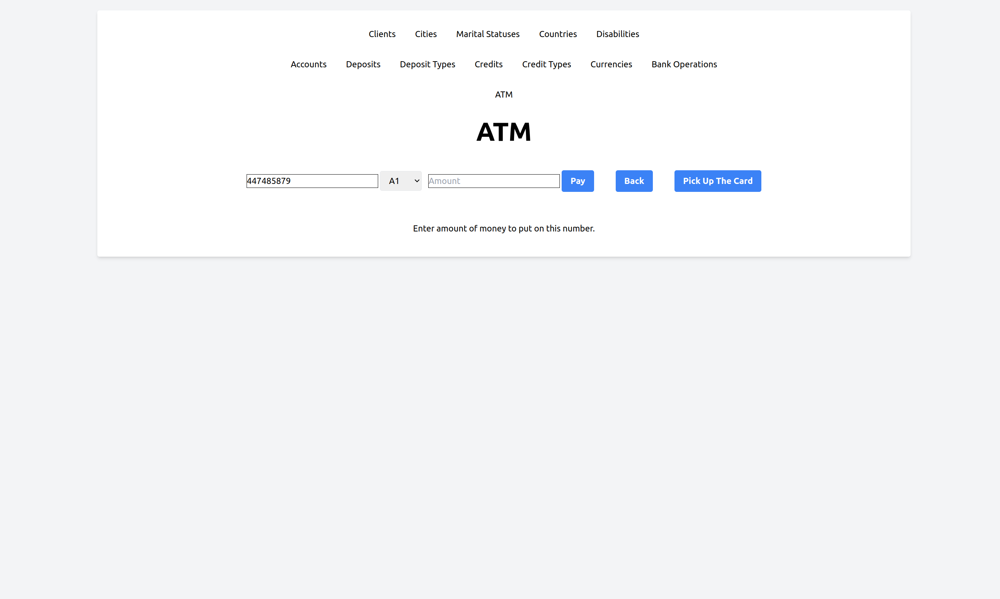

# Bank System

## Project Description
The Bank System project is a comprehensive banking management system. It is designed using the Model-View-Controller (MVC) pattern, ensuring a clear separation of concerns and enhancing maintainability.

The project is divided into three main parts:

1. **Customer Management**: This part handles the management of customer records, providing functionalities to create, read, update, and delete customer information.

2. **Credit and Deposit Management**: This part deals with the issuance of credits and deposits. It uses banking transactions to ensure accurate and reliable financial operations.

3. **ATM Functionality**: The third part implements the functionality of an ATM, allowing customers to perform various banking operations such as cash withdrawal, balance inquiry, and more.

## Technologies Used

- PHP
- Blade
- MySQL

## Contact Information

This project is developed by Valeryia Matveyeva. You can contact me at `matveyeva.valeryia@gmail.com`.